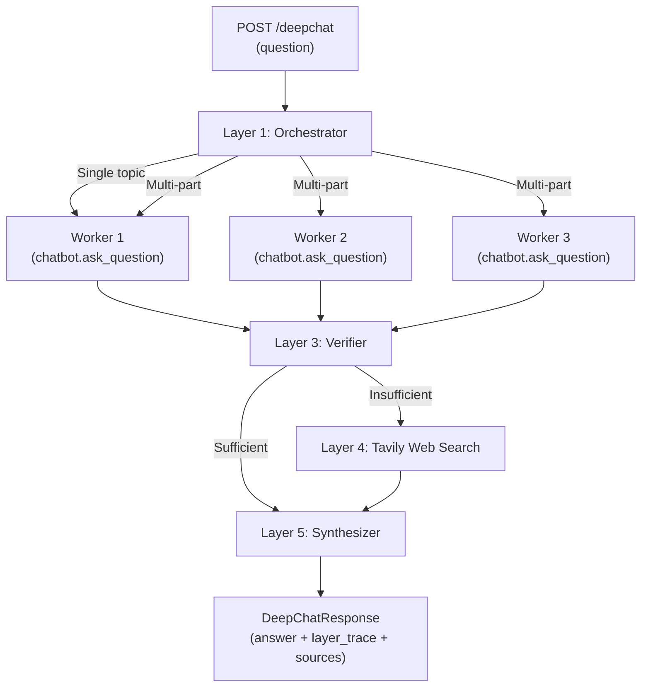

# `/deepchat` — 5-Layer Deep Research Route

Implement a new `POST /deepchat` endpoint that performs multi-part question splitting, parallel corpus retrieval per sub-question, per-sub-question verification, web-search fallback (Tavily) for failed sub-questions, and synthesized multi-source answer merging — all reusing the existing `chatbot.py` pipeline as building blocks.

## User Review Required

> [!IMPORTANT]
> **Tavily API Key Required**: The `.env` file currently has no `TAVILY_API_KEY`. The web-search fallback layer (Layer 4 fallback) needs a Tavily API key. Please add `TAVILY_API_KEY=tvly-...` to your `.env` file. If you don't have one, the route will still work — it will just skip web fallback and label those sub-questions as "insufficient corpus coverage."

> [!IMPORTANT]
> **Worker Agents = Same Chat Processing**: Per your instruction, each worker agent calls the **same processing logic** as the `/chat` route (the existing `chatbot.ask_question()` pipeline: retrieve → validate → synthesize). No separate model is needed. The workers are parallel invocations of the existing pipeline.

## Proposed Changes

### New Deep Research Engine Module

#### [NEW] [deep_research_engine.py](file:///c:/Users/rahman/Desktop/Backend_chatbot/deep_research_engine.py)

A self-contained engine module implementing all 5 layers:

| Layer | Class/Function | What it does |
|-------|---------------|-------------|
| **1. Orchestrator** | `Orchestrator.plan()` | Detects multi-part questions (keywords: "compare", "vs", "difference", multiple "?"). Calls Gemini Flash to split into 2-3 sub-questions when needed. Single-topic questions pass through unsplit. |
| **2. Worker Agents** | `WorkerAgent.execute()` | Each sub-question runs through `chatbot.ask_question()` — the **exact same pipeline** as `/chat` (retrieve → validate sufficiency → synthesize). Workers run in **parallel** via `asyncio.gather()` wrapping `loop.run_in_executor()` (since `ask_question` is synchronous). |
| **3. Verifier** | `Verifier.check()` | Examines each worker's result. Checks `validation.completeness_score` and `is_main_subject` from the existing `_validate_content_sufficiency()` output. A sub-question "passes" if score ≥ 5 and content is sufficient. Failed sub-questions are flagged for web fallback. |
| **4. Retrieval (Web Fallback)** | `WebFallbackRetriever.search()` | **Only** for sub-questions that failed the Verifier. Calls Tavily API (`search_depth="advanced"`). Results tagged as `[Web Source]`, never silently mixed with corpus material. Gracefully degrades if no Tavily key. |
| **5. Synthesizer** | `Synthesizer.merge()` | Final LLM call (via existing `UnifiedLLMClient`) merging all verified sub-answers — corpus-sourced and web-sourced — into one coherent, labeled report with `[Course Material]` / `[Web: URL]` inline citations. |

The engine class `DeepResearchEngine` ties all layers together with a single `run(question, chatbot, model)` method.

---

### API Server Route Addition

#### [MODIFY] [api_server.py](file:///c:/Users/rahman/Desktop/Backend_chatbot/api_server.py)

1. **New Pydantic models** (after existing models, ~line 165):
   - `DeepChatRequest(question, use_history?, model?)` — same fields as `/chat`
   - `DeepChatResponse(answer, sub_questions, layer_trace, sources, web_sources)` — the new response shape from the PDF

2. **New route** `@app.post("/deepchat")` (after the `/chat` route, ~line 455):
   - Imports and instantiates `DeepResearchEngine`
   - Calls `engine.run(question, chatbot, model)`
   - Returns `DeepChatResponse`

3. **Startup**: No changes needed — the engine reuses the existing `chatbot` singleton

---

### Environment Variable

#### [MODIFY] [.env](file:///c:/Users/rahman/Desktop/Backend_chatbot/.env)

Add placeholder for Tavily API key:
```
TAVILY_API_KEY=
```

---

## Architecture Flow



## Key Design Decisions

1. **Workers call `chatbot.ask_question()` directly** — this is the same full pipeline as `/chat`, including retrieval, validation, and LLM synthesis. Each worker gets a complete sub-answer with sources and validation scores.

2. **Parallel execution via asyncio + ThreadPoolExecutor** — `ask_question()` is synchronous, so we wrap each call in `run_in_executor()` and `asyncio.gather()` them for true parallelism.

3. **Verifier reuses existing validation output** — No duplicate validation call. The `validation` dict already returned by `ask_question()` contains `completeness_score` and `is_main_subject` from `_validate_content_sufficiency()`.

4. **Web fallback is per-sub-question** — Only failed sub-questions trigger a Tavily search, not the whole query. Results are clearly tagged.

5. **`layer_trace` field** — Each sub-question gets a trace entry: `{sub_question, resolved_by: "corpus"|"web", verifier_score, sources}` for debugging/metrics.

## Verification Plan

### Manual Verification
- Start the server with `python -m uvicorn api_server:app --reload`
- Test single-topic question: `POST /deepchat {"question": "What is photojournalism?"}` — should return single sub-question, corpus-resolved
- Test multi-part question: `POST /deepchat {"question": "Compare print journalism and radio journalism"}` — should split into sub-questions
- Test web fallback: `POST /deepchat {"question": "What is quantum computing vs media ethics?"}` — "quantum computing" should fail corpus and fall back to web (if Tavily key set), "media ethics" should resolve from corpus
- Verify existing `/chat` route still works unchanged
